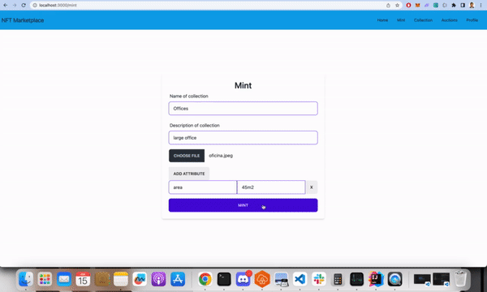

# NFT Auction Dapp with Nextjs, Solidity, and Hardhat



## Description
In this dapp the users can upload their digital assets to mint a NFT,then they will be able to start an auction.

The dapp has 5 tabs: `Home`, `Mint` ,`Collection`,`Auction`,`Profile`.

In `Home` you can connect your wallet with Metamask.

In `Mint` you can create your NFT.

In `Collection` you can visualize all the nft created.

In `Auction` you can visualize the auctions created , place a bid and complete the auction.

In `Profile` you can visualize your NFTs and you will be able to start an auction.


## Technology

Backend:
- Hardhat
- Solidity
- Open Zeppelin

Frontend:
- Metamask
- Pinata
- Next.js
- Tailwind CSS
- Daisy UI  
- Wagmi


## Prerequisites
Make sure you have installed all of the following prerequisites on your development machine:
* Git - [Download & Install Git](https://git-scm.com/downloads). OSX and Linux machines typically have this already installed.
* Node.js - [Download & Install Node.js](https://nodejs.org/en/download/) and the npm package manager. If you encounter any problems, you can also use this [GitHub Gist](https://gist.github.com/isaacs/579814) to install Node.js.
* Metamask - [Download & Install Metamask](https://metamask.io/download/)

## Running the demo

To run the demo follow these steps:

- Clone the project with the code below.

    ```sh
    # Make sure you have the above prerequisites installed already!
    git clone https://github.com/JohelCastilloV/nft-auction-marketplace.git
    
    ```
    
Backend   
1. Setup the backend
    ```sh
    cd backend # Navigate to the backend folder.
    npm install # Install all the dependencies
    npm run node # runing stand-alone hardhat network
    ``` 
    You  wil see a list of accounts with its private keys, import some accounts in your metamask wallet, more infomation [here](https://support.metamask.io/hc/en-us/articles/360015489331-How-to-import-an-account#h_01G01W07NV7Q94M7P1EBD5BYM4).

2. Deploy the contracts in local in a new terminal
    ```sh
    npm run deploy:localhost # deploy the contract in the hardhat network
    ```
Frontend
1. Head to [pinata](https://app.pinata.cloud/) and create an api key ( select option admin for testing purpose).

2. Create `.env.development` file in the root of the frontend directory and enter the following details.
   ```sh
   NEXT_PUBLIC_PINATA_DOMAIN=https://gateway.pinata.cloud
   PINATA_API_KEY={API_KEY}
   PINATA_SECRET_API_KEY={SECTE_API_KEY}
   ```

3. Open a new terminal and run the following commands.
    ```sh
    cd frontend # Navigate to the frontend folder.
    npm install # Install all the dependencies
    npm run dev # run the development server:
    ```
4. Open [http://localhost:3000](http://localhost:3000) with your browser to see the result.    

Questions about running the demo? [Open an issue](https://github.com/JohelCastilloV/nftAuctionMarketplace/issues). I am here to help ✌️

## Useful links

- ⚽ [Metamask](https://metamask.io/)
- 🚀 [Remix Editor](https://remix.ethereum.org/)
- 💡 [Hardhat](https://hardhat.org/)
- ✨ [Pinata](https://app.pinata.cloud)
- 🔥 [Next.js](https://nextjs.org/)
- 🐻 [Solidity](https://soliditylang.org/)
- 👀 [Wagmi](https://wagmi.sh/)